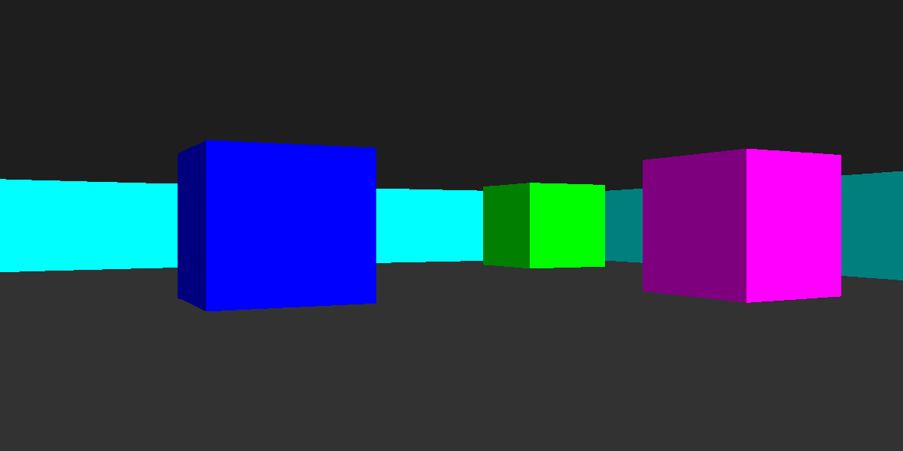

# Simple Raycaster
Simple raycaster made with python using pygame as a graphics library

## How to run
Make sure you have pygame install and then run it with `python ./raycast.py` in the shell.

## How it works?
It works by casting a ray in every direction in the POV and checking if it collides with a wall, and if it does it draws a vertical line there.
